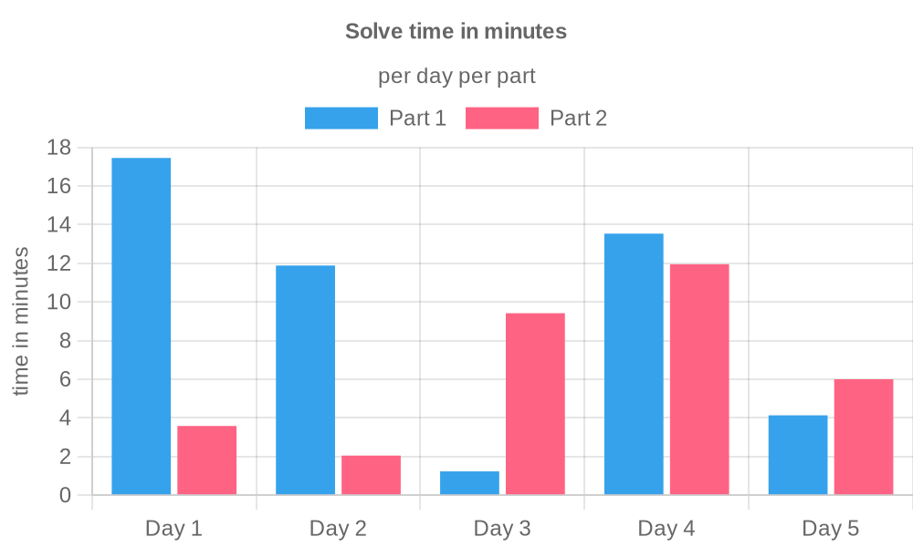
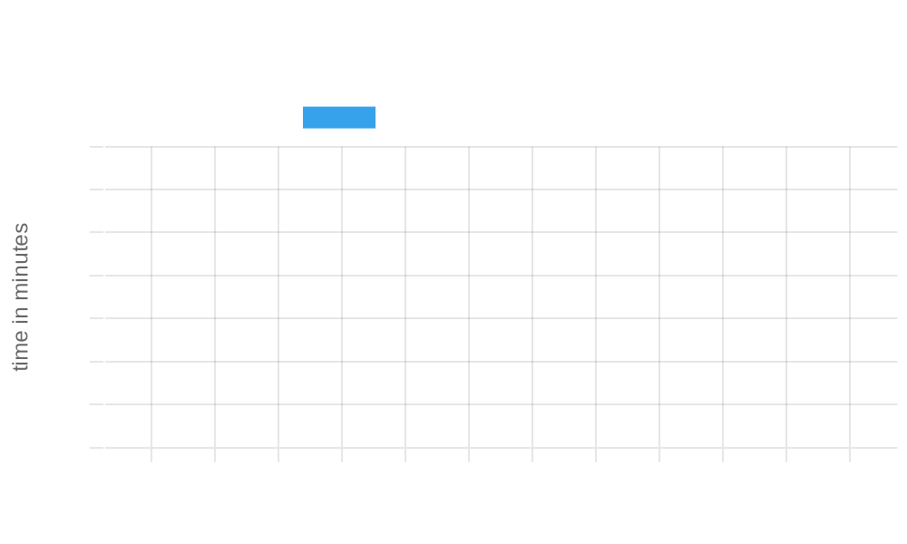
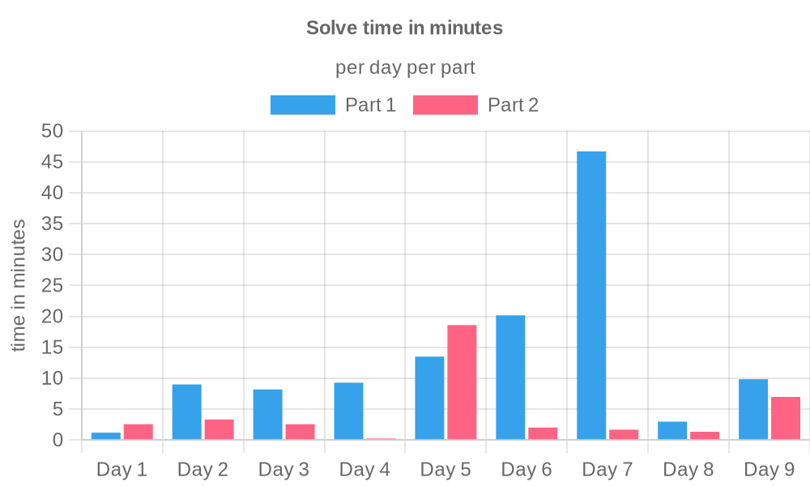

<div align="center">
    <a href="https://adventofcode.com">
        
    </a>
    <h1>Advent of Code</h1>
    <p><i>My advent of code solutions in TypeScript</i></p>
</div>

<!-- TOC -->
<details>
    <summary>Table of Contents</summary>
    <ol>
        <li>
          <a href="#about-advent-of-code">About Advent of Code</a>
        </li>
        <li>
          <a href="#my-advent-of-code-journey">My Advent of Code journey</a>
        </li>
        <li>
          <a href="#running-the-solutions">Running the solutions</a>
        </li>
        <li>
          <a href="#advanced-usage">Advanced usage</a>
        </li>
        <li>
          <a href="#technologies">Technologies</a>
          <ul>
            <li><a href="#language">Language</a></li>
            <li><a href="#package-manager--runtime">Package manager / Runtime</a></li>
            <li><a href="#cicd">CI/CD</a></li>
          </ul>
        </li>
        <li>
          <a href="#solve-time-charts">Solve time charts</a>
            <ul>
                <li><a href="#2016">2016</a></li>
                <li><a href="#2024">2024</a></li>
                <li><a href="#2015">2015</a></li>
            </ul>
        </li>
      </ol>
</details>
<!-- TOC -->

## About Advent of Code

Advent of Code is an Advent calendar of small programming puzzles
for a variety of skill levels that can be solved
in any programming language you like.
People use them as interview prep, company training,
university coursework, practice problems, a speed contest,
or to challenge each other.

You don't need a computer science background to participate -
just a little programming knowledge and some problem solving skills
will get you pretty far. Nor do you need a fancy computer;
every problem has a solution that completes in at most
15 seconds on ten-year-old hardware.

By completing the challenges, you earn stars.
After earning all 50 stars, you save Christmas!

## My Advent of Code journey

I started participating in Advent of Code in 2022, where I got 12 stars...

In 2023 I took it a bit more serious, and got all 50 stars.
You can find my solutions in [this repository](https://github.com/RobinHeidenis/aoc-2023).

2024 was a really fun year since it was the 10th anniversary of AOC.
I got all 50 stars, and you can find my solutions in this repository.
It had a bunch of references to the other years,
and even though I haven't completed those yet, I still had a lot of fun.

Now I'm working on completing all the years since 2015 before the 2025 edition starts.

As of 2025-01-25, I have successfully achieved all stars for AOC 2015.
2015 felt quite a lot easier than 2024, as you can probably tell from the graphs below.
There certainly were some tough ones, but overall the difficulty has increased quite
a lot in recent years. I enjoyed the simplicity, but also the toughness in some of them
that made you look up more efficient solutions or algorithms to help solve the puzzle.

I can tell the storylines have gotten better in recent years, since 2015's storyline was
nearly non-existant, just random exercises it felt like. I'm excited for february, where
we're going to get our stars back from the easter bunny :D. See you in the next paragraph!

## Running the solutions

This project uses [Bun](https://bun.sh) instead of Node.js.
Make sure to install Bun before anything else.

Run the following command to install the packages needed for the project

```sh
bun install
```

Then run the following to interactively pick a year, day, and part:

```sh
bun start
```

## Advanced usage

You can pass parameters to `bun start` to run a specific year, day, and part without having to go through the prompts.

| Parameter     | Example       | Notes                                                                          |
|---------------|---------------|--------------------------------------------------------------------------------|
| `--year`      | `--year 2024` | The year you want to run                                                       |
| `--day`       | `--day 21`    | The day you want to run. Goes up to `25`                                       |
| `--part`      | `--part 2`    | The part you want to run. Can be either `1` or `2`                             |
| `--testInput` | `--testInput` | Wether or not to use test.txt as input instead of input.txt. Defaults to false |

## Technologies

This project was created using Bun.
The graphs are automatically generated using Github Actions.

It uses the following technologies:

### Language

[](https://typescriptlang.org)

### Package Manager / Runtime

[](https://bun.sh)

### CI/CD

[](https://github.com/RobinHeidenis/advent-of-code/actions)

## Solve time charts

### 2016



### 2024



### 2015


