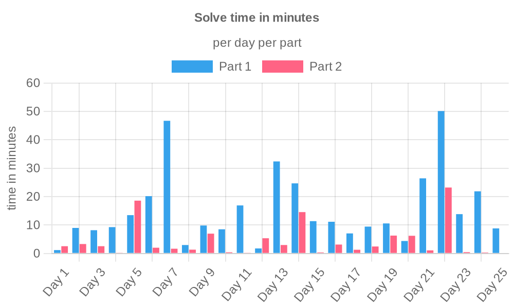
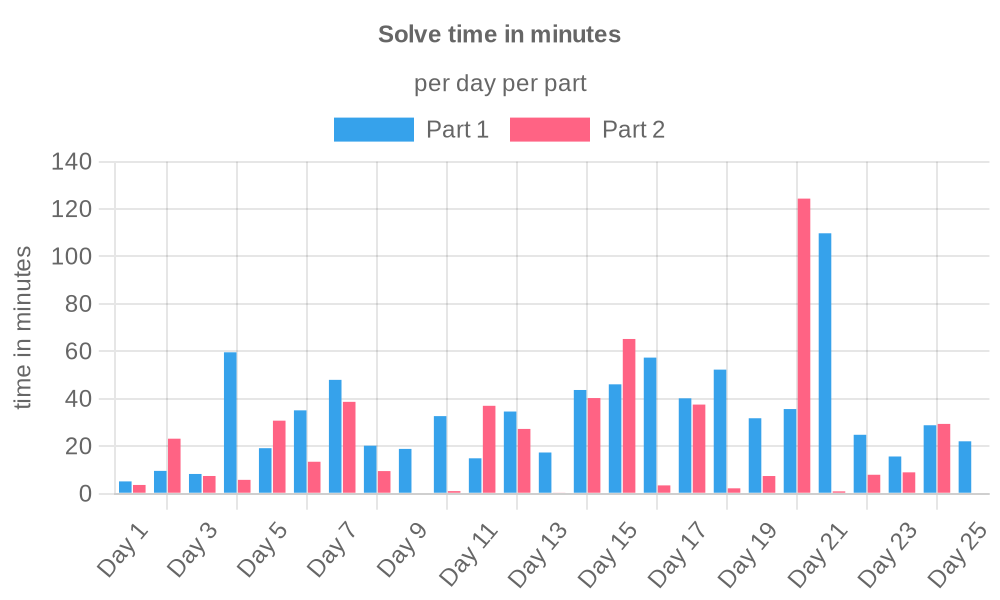

<div align="center">
    <a href="https://adventofcode.com">
        
    </a>
    <h1>Advent of Code</h1>
    <p><i>My advent of code solutions in TypeScript</i></p>
</div>

<!-- TOC -->
<details>
    <summary>Table of Contents</summary>
    <ol>
        <li>
          <a href="#about-heimdall">About Heimdall</a>
        </li>
        <li>
          <a href="#features">Features</a>
        </li>
        <li>
            <a href="#usage">Usage</a>
            <ul>
                <li><a href="#docker-container">Docker container</a></li>
                <ul>
                    <li><a href="#using-docker-desktop">Using Docker Desktop</a></li>
                </ul>
                <li><a href="#standalone-application">Standalone application</a></li>
                <ul>
                    <li><a href="#using-docker-desktop-1">Using Docker Desktop</a></li>
                </ul>
            </ul>
        </li>
        <li>
          <a href="#technologies">Technologies</a>
          <ul>
            <li><a href="#language">Language</a></li>
            <li><a href="#deployed-to">Deployed to</a></li>
            <li><a href="#cicd">CI/CD</a></li>
            <li><a href="#released-using">Released using</a></li>
            <li><a href="#logo-created-using">Logo created using</a></li>
          </ul>
        </li>
        <li>
          <a href="#screenshots">Screenshots</a>
            <ul>
                <li><a href="#terminal-output">Terminal output</a></li>
                <li><a href="#discord-notifications">Discord notifications</a></li>
                <ul>
                    <li><a href="#container-started">Container started</a></li>
                    <li><a href="#container-stopped">Container stopped</a></li>
                    <li><a href="#container-healthy">Container healthy</a></li>
                    <li><a href="#container-unhealthy">Container unhealthy</a></li>
                    <li><a href="#container-errored">Container errored</a></li>
                </ul>
                <li><a href="#periodic-notification">Periodic notification</a></li>
                <ul>
                    <li><a href="#running-containers">Running containers</a></li>
                    <li><a href="#all-containers">All containers</a></li>
                </ul>
                <li><a href="#notifications-with-a-hostname">Notifications with a hostname</a></li>
            </ul>
        </li>
      </ol>
</details>
<!-- TOC -->

## About Advent of Code

Advent of Code is an Advent calendar of small programming puzzles for a variety of skill levels that can be solved in any programming language you like. People use them as interview prep, company training, university coursework, practice problems, a speed contest, or to challenge each other.

You don't need a computer science background to participate - just a little programming knowledge and some problem solving skills will get you pretty far. Nor do you need a fancy computer; every problem has a solution that completes in at most 15 seconds on ten-year-old hardware.

By completing the challenges, you earn stars.
After earning all 50 stars, you save Christmas!

## My Advent of Code journey

I started participating in Advent of Code in 2022, where I got 12 stars...

In 2023 I took it a bit more serious, and got all 50 stars.
You can find my solutions in [this repository](https://github.com/RobinHeidenis/aoc-2023).
2024 was a really fun year since it was the 10th anniversary of AOC.
It had a bunch of references to the other years,
and even though I haven't completed those yet, I still had a lot of fun.
I got all 50 stars.

Now I'm working on completing all the years since 2015 before the 2025 edition starts.

## Running the solutions

This project uses [Bun](https://bun.sh) instead of Node.js.
Make sure to install Bun before anything else.

Run the following command to install the packages needed for the project

```sh
bun install
```

Then run the following to interactively pick a year, day, and part:

```sh
bun start
```

## Advanced usage

You can pass parameters to `bun start` to run a specific year, day, and part without having to go through the prompts.

| Parameter     | Example       | Notes                                                                          |
|---------------|---------------|--------------------------------------------------------------------------------|
| `--year`      | `--year 2024` | The year you want to run                                                       |
| `--day`       | `--day 21`    | The day you want to run. Goes up to `25`                                       |
| `--part`      | `--part 2`    | The part you want to run. Can be either `1` or `2`                             |
| `--testInput` | `--testInput` | Wether or not to use test.txt as input instead of input.txt. Defaults to false |

## Technologies

This project was created using Bun.
The graphs are automatically generated using Github Actions.

It uses the following technologies:

### Language

[](https://typescriptlang.org)

### Package Manager / Runtime

[](https://bun.sh)

### CI/CD

[](https://github.com/RobinHeidenis/advent-of-code/actions)

## Solve time charts

### 2015



### 2024


